# Components map

Actor → Trigger → Input → Context → Processing → AI → Output → **Human Review**. Publication sits outside the
automation boundary: it is a manual action by Meera, and no component of this system can perform it.

```mermaid
flowchart LR
    subgraph ACTOR["1 · Actor"]
        M(["Meera Pillai<br/>founder, Skinstinct"])
    end

    subgraph TRIGGER["2 · Trigger"]
        TG["Telegram message<br/>(existing habit)"]
        WH["POST /api/webhook<br/>secret header verified<br/>update_id claimed once"]
    end

    subgraph INPUT["3 · Input"]
        TXT["Text note"]
        VOI["Voice note<br/>getFile → download (in memory)"]
    end

    subgraph CONTEXT["4 · Context"]
        VS[("Voice Skill<br/>from 15 published pieces<br/>Supabase · file fallback")]
        RSS["Google News RSS<br/>India / English<br/>headline metadata only"]
        MEM[("Supabase memory<br/>notes · drafts ·<br/>voice_skills · telegram_updates")]
    end

    subgraph PROCESSING["5 · Processing (code)"]
        VAL["Zod validation<br/>total recomputed<br/>threshold ≥ 6"]
        FILT["Recency filter (30 days)<br/>relevance ≥ 0.70"]
        FACT["Figure check<br/>+ source block builder"]
    end

    subgraph AI["6 · AI (Gemini only)"]
        GT["Gemini transcription<br/>verbatim"]
        GS["Gemini scoring<br/>5 × 0-2 rubric"]
        GK["Gemini keywords"]
        GR["Gemini news relevance"]
        GD["Gemini drafting<br/>note + Voice Skill<br/>+ news only if relevant"]
    end

    subgraph OUTPUT["7 · Output"]
        REJ["Rejection + reason<br/>(score < 6) · STOP"]
        DRF["Draft stored as PENDING<br/>sent to Telegram<br/>+ NEWS SOURCE block if used"]
    end

    subgraph REVIEW["8 · HUMAN REVIEW: Meera decides"]
        DEC{"APPROVE / REJECT<br/>reply in Telegram"}
        APP["status = approved<br/>'NOT published' · STOP"]
        RJ["status = rejected<br/>kept, not deleted · STOP"]
    end

    subgraph OUTSIDE["OUTSIDE THE AUTOMATION BOUNDARY"]
        LI(["Meera edits & publishes<br/>on LinkedIn manually"])
    end

    M --> TG --> WH
    WH --> TXT
    WH --> VOI --> GT
    TXT --> MEM
    GT --> MEM
    MEM --> GS --> VAL
    VAL -- "< 6" --> REJ --> M
    VAL -- "≥ 6" --> GK --> RSS --> FILT --> GR
    GR -- "relevant" --> GD
    GR -. "not relevant / RSS down" .-> GD
    VS --> GD
    GD --> FACT --> DRF --> MEM
    DRF --> DEC
    DEC -- APPROVE --> APP
    DEC -- REJECT --> RJ
    APP --> MEM
    RJ --> MEM
    APP ==>|"human action only"| LI

    classDef human fill:#fff3cd,stroke:#b8860b,stroke-width:3px,color:#222;
    classDef boundary fill:#f8d7da,stroke:#a61b29,stroke-width:3px,stroke-dasharray:6 4,color:#222;
    classDef ai fill:#e0ecff,stroke:#3a6fd8,color:#222;
    class REVIEW,DEC,APP,RJ human;
    class OUTSIDE,LI boundary;
    class GT,GS,GK,GR,GD ai;
```

## Stage by stage

| Stage | Component | Notes |
|---|---|---|
| Actor | Meera | The only author. The bot can be locked to her chat with `TELEGRAM_ALLOWED_CHAT_IDS`. |
| Trigger | Telegram → `/api/webhook` | Secret header checked; `update_id` claimed atomically, so retries do nothing. Responds 200 at once; work continues in `after()`. |
| Input | Text, or voice via `getFile` | Audio kept in memory only. Unsupported media get "I can currently process text and voice notes." |
| Context | Voice Skill, Google News RSS, Supabase | Voice Skill describes *how* she writes, not facts. News is headline metadata, never full articles. |
| Processing | Code-level rules | Scores validated and re-summed; threshold 6; news must be ≤ 30 days old and ≥ 0.70 confidence; invented figures flagged. |
| AI | Gemini (5 calls max) | Transcription, scoring, keywords, relevance, drafting. JSON output, validated; bounded retries. |
| Output | Rejection reason, or pending draft | The mandatory source block appears only when news was actually used. |
| **Human review** | **APPROVE / REJECT** | Changes a status field and stops. Nothing is deleted, and nothing is published. |
| Outside | Manual LinkedIn publishing | No LinkedIn API, credential or code path exists in the system (enforced by a test). |
